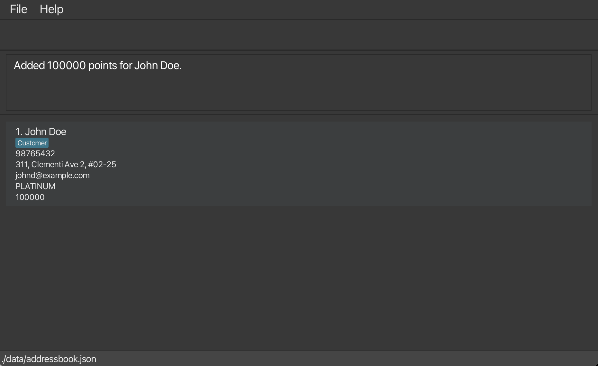
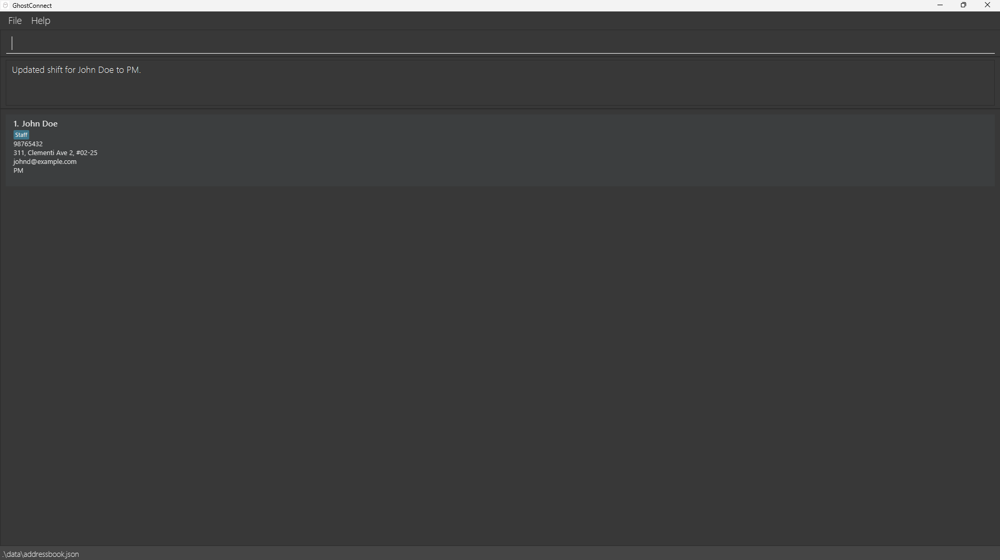

# GhostConnect User Guide

GhostConnect is a **desktop app for managing contacts, optimized for fast and efficient use through a Command Line Interface** (CLI) while retaining the convenience of a **Graphical User Interface (GUI)**.
Designed for users who value speed and precision, GhostConnect lets you organize, search, and update your contacts seamlessly &ndash; faster than traditional GUI-based contact managers.

    
 Table of Contents 

- [Quick Start](#quick-start)
- [Features](#features)
  - [Help](#accessing-the-help-page-help)
  - [Adding a Contact](#adding-a-contact-add)
  - [Listing all Contacts](#listing-all-contacts-list)
  - [Editing a Contact](#editing-a-contact-edit)
  - [Locating Contacts by Name or Category](#locating-contacts-by-name-or-category-find)
  - [Deleting a Contact](#deleting-a-contact-delete)
  - [Clearing all Contacts](#clearing-all-contacts-clear)
- [Command Summary](#command-summary)

<page-nav-print />

--------------------------------------------------------------------------------------------------------------------

## Quick Start

1. Ensure you have Java `17` or above installed in your Computer. 
   **Mac users:** Ensure you have the precise JDK version prescribed [here](https://se-education.org/guides/tutorials/javaInstallationMac.html).

2. Download the latest `.jar` file from [here](https://github.com/se-edu/addressbook-level3/releases).

3. Copy the file to the folder you want to use as the _home folder_ for your AddressBook.

4. Open a command terminal, `cd` into the folder you put the jar file in, and use the `java -jar ghostConnect.jar` command to run the application. 
   A GUI similar to the below should appear in a few seconds. Note how the app contains some sample data. 
   

5. Type the command in the command box and press Enter to execute it. e.g. typing **`help`** and pressing Enter will open the help window. 
   Some example commands you can try:

   * `list` : Lists all contacts.

   * `add n/John Doe p/98765432 e/johnd@example.com a/311, Clementi Ave 2, #02-25 c/Customer` : Adds a customer contact named `John Doe` to the Address Book.

   * `delete 3` : Deletes the 3rd contact shown in the current list.

   * `clear` : Deletes all contacts.

   * `exit` : Exits the app.

1. Refer to the [Features](#features) below for details of each command.

--------------------------------------------------------------------------------------------------------------------

## Features

<box type="info" seamless></box>

**Notes about the command format:** 

* Words in `UPPER_CASE` are the parameters to be supplied by the user. 
  e.g. in `add n/NAME`, `NAME` is a parameter which can be used as `add n/John Doe`.

* All fields are compulsory. 
  e.g `n/NAME c/Category` can be used as `n/John Doe c/Customer` or as `n/John Doe c/Supplier`, but not `n/John Doe`.

* Parameters can be in any order. 
  e.g. if the command specifies `n/NAME p/PHONE_NUMBER`, `p/PHONE_NUMBER n/NAME` is also acceptable.

* Extraneous parameters for commands that do not take in parameters (such as `help`, `list`, `exit` and `clear`) will be ignored. 
  e.g. if the command specifies `help 123`, it will be interpreted as `help`.

* If you are using a PDF version of this document, be careful when copying and pasting commands that span multiple lines as space characters surrounding line-breaks may be omitted when copied over to the application.
</box>

### General Commands

#### Accessing the Help Page: `help`

Shows a message explaining how to access the help page.

Format: `help`

#### Adding a Contact: `add`

Adds a person to the address book.

Format: `add n/NAME p/PHONE_NUMBER e/EMAIL a/ADDRESS c/CATEGORY`

* Contact to be added cannot have the same name or phone number as existing contacts

<box type="tip" seamless></box>

**Tip:** A person can only belong to either of these 3 categories: Customer | Supplier | Staff
</box>

Examples:
* `add n/John Doe p/98765432 e/johnd@example.com a/John street, block 123, #01-01 c/Customer`  
* `add n/Betsy Crowe e/betsycrowe@example.com a/Yishun p/68998899 c/Staff` 

#### Listing all Contacts: `list`

Shows a list of all persons in the address book.

Format: `list`

#### Editing a Contact: `edit`

Edits an existing person in the address book.

Format: `edit INDEX [n/NAME] [p/PHONE] [e/EMAIL] [a/ADDRESS] [c/CATEGORY]`

* Edits the person at the specified `INDEX`. The index refers to the index number shown in the displayed person list. The index **must be a positive integer** 1, 2, 3, …​
* At least one of the optional fields must be provided.
* Existing values will be updated to the input values.
* Input values for name/phone must not be the same as the name/phone of other existing contacts.
* When editing a contact’s category, any fields specific to the previous category will be replaced with those of the new category.

Examples:
*  `edit 1 p/91234567 e/johndoe@example.com` Edits the phone number and email address of the 1st person to be `91234567` and `johndoe@example.com` respectively.
*  `edit 2 n/Betsy Crower c/Customer` Edits the name of the 2nd person to be `Betsy Crower` and category to `Customer`

#### Locating Contacts by Name or Category: `find`

Finds persons whose names or category contain any of the given keywords.

Format: `find KEYWORD [MORE_KEYWORDS]`

* The search is case-insensitive. e.g `hans` will match `Hans`
* The order of the keywords does not matter. e.g. `Hans Bo` will match `Bo Hans`
* Both names and categories are searched.
* Substrings will also be matched e.g. `Cho` will match `Nicholas`
* Persons matching at least one keyword will be returned (i.e. `OR` search).
  e.g. `Hans Bo` will return `Hans Gruber`, `Bo Yang`

Examples:
* `find John` returns `john` and `John Doe`
* `find alex david` returns `Alex Yeoh`, `David Li`
* `find cust` returns all persons with `Customer` category
* `find colleagues family` returns all persons tagged with `colleagues` or `family` 
  

#### Deleting a Contact: `delete`

Deletes the specified person from the address book.

Format: `delete INDEX`

* Deletes the person at the specified `INDEX`.
* The index refers to the index number shown in the displayed person list.
* The index **must be a positive integer** 1, 2, 3, …​

Examples:
* `list` followed by `delete 2` deletes the 2nd person in the address book.
* `find Betsy` followed by `delete 1` deletes the 1st person in the results of the `find` command.

### Add Order for Supplier: `addOrder`

Adds an Order to the specified Supplier's list of orders.

Format: `addOrder p/PHONE_NUMBER i/ITEM_NAME q/QUANTITY u/UNIT_PRICE d/DELIVERY_DAY`

* Supplier is specified through their `PHONE_NUMBER`
* `ITEM_NAME` and `DELIVERY_DAY` can only be filled with alphanumeric characters.
* `QUANTITY` can only be positive numerical values that are above 0.
* `UNIT PRICE` can only be positive numerical values, that are up to 2 decimal places.
* Duplicate orders will not be added into the supplier's list of orders.

Examples:

Assuming that the Supplier `John Doe` has the phone number `91234567`
* `addOrder p/91234567 i/Chicken q/20 u/5.60 d/every Tuesday`
* The above command creates an order in John Doe's order list.
* The order indicates an order of 20 Chicken, at the unit price of $5.60, to be delivered every Tuesday.

### Update Order for Supplier: `updateOrder`

Updates a specified order in a Supplier's order list.

Format: `updateOrder p/PHONE_NUMBER o/ORDER_INDEX [i/ITEM_NAME] [q/QUANTITY] [u/UNIT_PRICE] [d/DELIVERY_DAY]`

* Edits the order found in the specified Supplier's order list.
* Order is found at the specified `ORDER_INDEX`.
* At least one of the optional fields must be provided.
* * `ITEM_NAME` and `DELIVERY_DAY` can only be filled with alphanumeric characters.
* `QUANTITY` can only be positive numerical values that are above 0.
* `UNIT PRICE` can only be positive numerical values, that are up to 2 decimal places.
* In the event of duplicate orders upon updating, the command will not be executed.

Example:
* Assuming that the Supplier `John Doe` has the phone number `91234567`
* Assuming that the below order is added into John Doe's order list, and it is the only order in the list
    * Item Name - Chicken
    * Quantity - 20
    * Unit Price - 5.60
    * Delivery Day - every Tuesday

* `updateOrder p/91234567 o/1 i/Fish`
* The above command will edit the first order in John Doe's order list, such that the item name is changed to `Fish`.

## Clearing all entries : `clear`

Clears all entries from the address book.

Format: `clear`

### Category Specific Commands

#### Adding Points to a Customer Contact: `updatePoints`

Award points for specified customer based of amount spent.

Format: `updatePoints p/PHONE b/BILL_AMOUNT`

* Can only be performed on Customers.
* Bill amount can be any positive number with at most 2 decimal points e.g. `50`, `50.15`, `50.1`
* Customer Tier will update based on number of points accumulated.

Examples:
* `updatePoints p/98765432 b/100000.00` adds `100000 points` for `John Doe`
 
  

#### Changing Shift for a Staff Contact: `updateShift`

Update shift for the specified staff.

Format: `updatePoints p/PHONE s/SHIFT`

* Can only be performed on Staff.
* Shift value is limited to only `AM` or `PM`.

Examples:
* `updateShift p/98765432 b/PM` updates shift to `PM` for `John Doe`
   
  

### Exiting the Program: `exit`

Exits the program.

Format: `exit`

### Saving the Data

AddressBook data are saved in the hard disk automatically after any command that changes the data. There is no need to save manually.

### Editing the Data File

AddressBook data are saved automatically as a JSON file `[JAR file location]/data/addressbook.json`. Advanced users are welcome to update data directly by editing that data file.

<box type="warning" seamless></box>

**Caution:**
If your changes to the data file makes its format invalid, AddressBook will discard all data and start with an empty data file at the next run.  Hence, it is recommended to take a backup of the file before editing it. 
Furthermore, certain edits can cause the AddressBook to behave in unexpected ways (e.g., if a value entered is outside the acceptable range). Therefore, edit the data file only if you are confident that you can update it correctly.
</box>

### Archiving Data Files `[coming in v2.0]`

_Details coming soon ..._

--------------------------------------------------------------------------------------------------------------------

## FAQ

**Q**: How do I transfer my data to another Computer? 
**A**: Install the app in the other computer and overwrite the empty data file it creates with the file that contains the data of your previous AddressBook home folder.

--------------------------------------------------------------------------------------------------------------------

## Known issues

1. **When using multiple screens**, if you move the application to a secondary screen, and later switch to using only the primary screen, the GUI will open off-screen. The remedy is to delete the `preferences.json` file created by the application before running the application again.
2. **If you minimize the Help Window** and then run the `help` command (or use the `Help` menu, or the keyboard shortcut `F1`) again, the original Help Window will remain minimized, and no new Help Window will appear. The remedy is to manually restore the minimized Help Window.

--------------------------------------------------------------------------------------------------------------------

## Command summary

Action     | Format, Examples
-----------|----------------------------------------------------------------------------------------------------------------------------------------------------------------------
**Add**    | `add n/NAME p/PHONE e/EMAIL a/ADDRESS c/CATEGORY`   e.g., `add n/James Ho p/98765432 e/jamesho@example.com a/123, Clementi Rd, 1234665 c/Customer`
**Clear**  | `clear`
**Delete** | `delete INDEX`  e.g., `delete 3`
**Edit**   | `edit INDEX [n/NAME] [p/PHONE] [e/EMAIL] [a/ADDRESS] [c/CATEGORY]`  e.g.,`edit 2 n/James Lee e/jameslee@example.com`
**Find**   | `find KEYWORD [MORE_KEYWORDS]`  e.g., `find James Jake`
**UpdatePoints**   | `updatePoints p/PHONE b/BILL_AMOUNT`  e.g `updatePoints p/98765432 b/100.00`
**UpdateShift**   | `updateShift p/PHONE s/SHIFT`  e.g `updateShift p/98765432 b/PM`
**List**   | `list`
**Help**   | `help`

